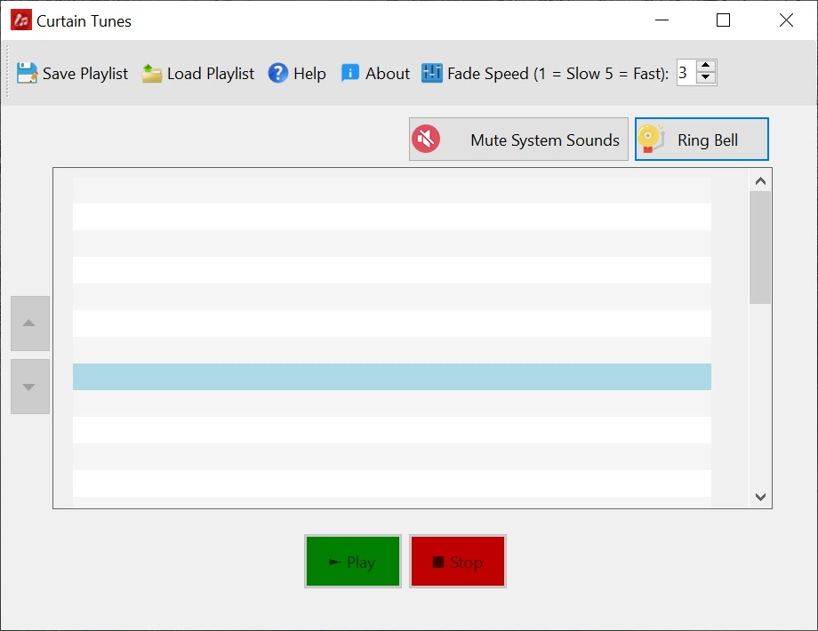

# Curtain Tunes v0.1

Curtain Tunes is a lightweight live-event intro music and video utility designed for wrestling, MMA, comedy shows, theater productions, school events, podcasts, churches, talent shows, and any live production where performers or guests are announced.

The software allows operators to quickly select performers, instantly play intro music or video, smoothly fade media out, save/load playlists, manage live entrances during events, and automatically handle fullscreen audience-screen playback on secondary monitors.

Curtain Tunes was built specifically for chaotic live-event environments where simplicity, speed, and reliability matter more than flashy features.

It also includes an integrated ring bell, automatic monitor detection, audience-screen video playback, temporary status messaging, missing-file detection, and live playlist management tools.

---

# We've All Been There...

The local indie wrestling show where:

* Somebody’s entrance music starts playing from a YouTube browser tab
* Some Viagra commercial starts playing instead of the music
* The greenhorn trainee working sound fumbles through Spotify or whatever media player
* A performer's intro music cuts out hard instead of fading professionally
* Windows suddenly makes the USB disconnect sound or the low battery sound through the arena speakers
* The promoter is yelling, “PLAY HIS MUSIC!”
* The wrong MP3 starts playing
* The announcer stalls awkwardly while someone digs through folders
* A wrestler walks out to complete silence...or the wrong music
* Somebody accidentally closes the music player mid-show
* The projector gets unplugged and the entire setup crashes
* The fullscreen video ends up on the wrong monitor
* Somebody loses focus on the audience display window during the show

I struggled with all of this as a wrestling promoter, so I wrote Curtain Tunes...and I figured I'd share it with the world.

Curtain Tunes is designed to be extremely simple, greenhorn-proof, and easy to install. All you have to do is unzip it, drop it anywhere you want, and double-click it.

No installer. No accounts. No subscriptions. No nonsense.

---



---

# No Ads, Spyware, Tracking or Any Other Junk

Curtain Tunes contains:

* No ads
* No telemetry
* No subscriptions
* No spyware
* No accounts
* No cloud dependency
* No activation nonsense

It's completely free.

It has also been scanned by 30 different virus scanners including Microsoft, Acronis, Symantec, Kaspersky, and Avast.

---

# Features

## Audio + Video Playback

* Instant intro music playback
* Automatic audio/video detection
* Dedicated fullscreen audience-screen video playback
* VLC-powered video playback engine
* Smooth fade-out stopping
* Automatic volume restoration after fades
* Built-in ring bell sound effect

---

## Audience Screen System

* Dedicated audience-display window
* Automatic fullscreen playback on monitor #2
* Automatic monitor detection and reconfiguration
* Windowed fallback mode for single-monitor systems
* Dedicated taskbar icon for quick recovery if focus is lost
* Black-background presentation mode
* Automatic monitor reconnect handling
* Automatic HDMI/projector recovery support

---

## Playlist Management

* Performer-based playlist system
* Save and load playlists
* Missing-file detection when loading playlists
* Move performers up/down during live events
* Delete performers with confirmation dialog
* Automatic playlist compaction after deletion
* Temporary status messages for live operator feedback

---

## Live Event Workflow Features

* Large operator-friendly interface
* Fast performer selection
* Designed specifically for high-pressure live environments
* Greenhorn-friendly operation
* Simple portable workflow
* Minimal setup time

---

## Portable Design

* Portable single-file executable. You need just one file
* No installation required
* Runs directly from desktop, USB drive, or folder
* No registry dependencies or changes
* No cloud nonsense
* No external database required

---

# Typical Uses

* Professional Wrestling
* MMA Events
* Comedy Shows
* Live Podcasts
* Theater Productions
* Talent Shows
* School Events
* Church Productions
* Guest Introductions
* Award Ceremonies
* Live Productions

---

# Usage

## Adding a Performer

1. Double-click a performer slot
2. Enter the performer name
3. Select an audio or video file
4. Click OK

---

## Playing Media

1. Select a performer
2. Click Play

Curtain Tunes automatically detects whether the media is audio or video.

* Audio files play directly through the sound system
* Video files automatically open in the Audience Screen window

---

## Stopping Media

Click Stop to smoothly fade out playback.

Fade speed is adjustable using the Fade Speed control.

---

## Rearranging Performers

Use the Move Up and Move Down buttons to rearrange performers during live events.

---

## Deleting Performers

Use the Delete button to remove performers from the playlist.

Curtain Tunes automatically:

* Asks for confirmation
* Shifts remaining entries upward
* Clears the final slot

---

# Playlist Files

Curtain Tunes stores playlists as simple text files for easy backup and portability.

Each line contains:

```text
Performer Name~Media File Path
```

Example:

```text
The Destroyer~C:\Themes\destroyer.mp3
```

---

# Recommended Setup

For best results during live events:

* Use a dedicated laptop whenever possible
* Use a second monitor or projector for audience playback
* Disable Windows notifications
* Disable screen savers and sleep mode
* Use wired audio connections when possible
* Test all media files before the audience arrives
* Keep a spare HDMI cable available
* Avoid unplugging display devices during playback

---

# System Requirements

* Windows 10 or Windows 11
* Audio output device

Recommended for video playback:

* Second monitor, projector, or HDMI display

---

# Virus Scan / File Verification

Kaspersky scan result:

https://opentip.kaspersky.com/535A05E7D4C8B0243144449C8156F0D863F0D124E159249610429A556E9F41D1/results

SHA256:

```text
535a05e7d4c8b0243144449c8156f0d863f0d124e159249610429a556e9f41d1
```

---

# License

Curtain Tunes is proprietary closed-source software provided free of charge.

Free redistribution is permitted.

Curtain Tunes is provided "AS IS" WITHOUT WARRANTY OF ANY KIND.

© 2026 Norm Kaiser. All Rights Reserved.
